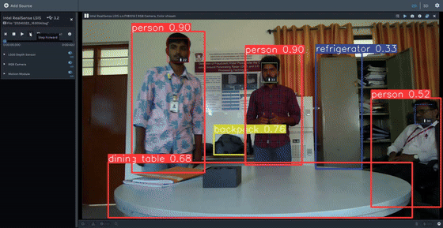
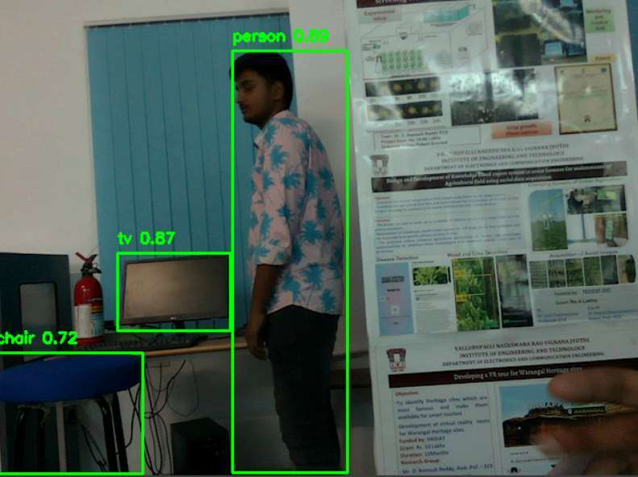
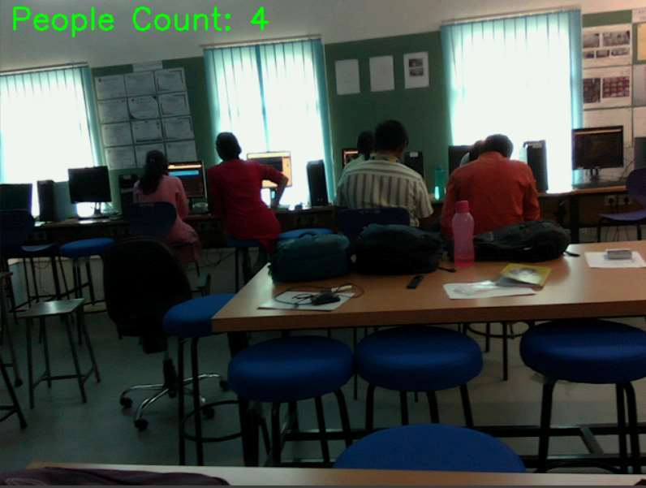
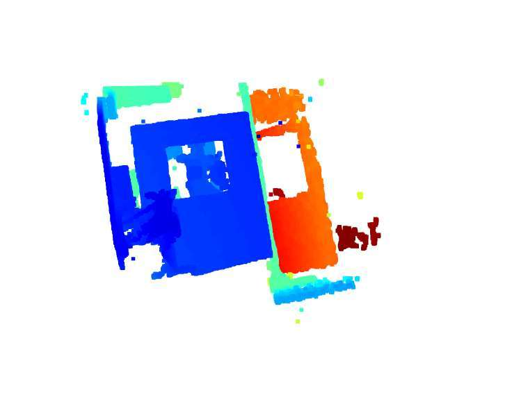
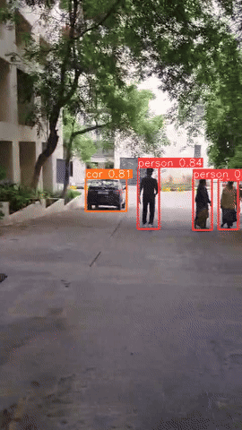

# LiDAR-Based Object Detection and Counting

Object detection and instance counting in 3D scenes, combining **YOLOv8** inference with **Intel RealSense L515** LiDAR streams.



## Features
- Runs on **live** L515 streams and **recorded** (.bag) sequences, and also on plain video
- YOLOv8 detection on the RGB stream, with each object's **distance** taken from the aligned depth frame
- **Per-class instance counting**, including a live people count
- **3D point cloud** of the scanned scene, viewed with Open3D

## Pipeline
```
L515 (RGB + depth) → depth-to-colour alignment → YOLOv8 → per-box median depth → counting → OpenCV display
                                                                                └→ Open3D point cloud
```

## Results

| Detection with confidence | People counting | Point cloud (L515) |
|---|---|---|
|  |  |  |

Outdoor test on recorded video:



## Hardware: Intel RealSense L515
- Range: 0.25–9 m
- Depth resolution: 1024×768 (up to 30 FPS)
- RGB camera: 2 MP
- Connection: USB 3.1

## How to implement

**1. Get the hardware ready (skip for plain video)**
- Intel RealSense L515 connected to a **USB 3.x** port. USB 2 cannot carry the depth stream.
- Install the [Intel RealSense SDK 2.0](https://github.com/IntelRealSense/librealsense/releases) and open **RealSense Viewer** once to confirm the camera streams. Update the firmware if the Viewer prompts you.
- The L515 is end-of-life: use SDK **v2.54.x or older**, because newer releases dropped L515 support.

**2. Set up Python (3.8–3.11)**
```bash
git clone https://github.com/Vipul-9/lidar-yolov8-realsense.git
cd lidar-yolov8-realsense
python -m venv venv
venv\Scripts\activate          # Windows
# source venv/bin/activate      # Linux / macOS
pip install -r requirements.txt
```
`yolov8n.pt` downloads automatically on the first run.

**3. Run it**
```bash
python main.py --live                        # live L515 stream
python main.py --bag recordings/scene.bag    # recorded stream
python main.py --video clip.mp4              # plain video (no depth)
python main.py --video 0                     # webcam (no depth)
python main.py --live --pointcloud           # press 'p' to open the 3D point cloud
python main.py --live --save out.mp4         # save the annotated output
```
Press `q` or `Esc` to quit.

**4. Record your own .bag file (optional)**
In RealSense Viewer, enable the RGB and depth streams and click **Record**. Pass the saved file with `--bag`.

**5. Tune**
| Option | Default | Description |
|---|---|---|
| `--model` | `yolov8n.pt` | YOLOv8 weights (n/s/m/l/x): larger is more accurate and slower |
| `--conf` | `0.35` | Confidence threshold: raise it to cut false detections |

**Troubleshooting**
- *No device connected:* check the USB 3 port and cable, and close RealSense Viewer, which holds the camera.
- *`pyrealsense2` fails to install:* use Python 3.8–3.11.
- *Low FPS:* use `yolov8n.pt` or a CUDA-enabled PyTorch build.

## Tools
Python, YOLOv8 (Ultralytics), Intel RealSense SDK (pyrealsense2), OpenCV, Open3D

## Contributing
I'm open to open-source contributions and collaboration. Issues and pull requests are welcome.
You can reach me at **vipulatluri98@gmail.com**.
